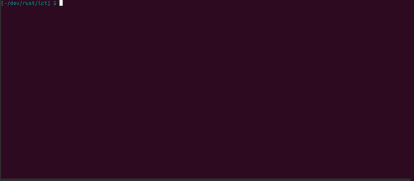

LCov Tool
=========

Very simple command line tool that parses a LCOV report and print coverage statistics as a tree.

Usage
-----

```
lct --file path/to/lcov_coverage_report_file.dat --levels 3
```
will parse the file and print a report with the first 3 levels in the file/folder hierarchy.

Call `lct --help` for the full set of available options.

```
lct-ui --file path/to/lcov_coverage_report_file.dat
```
will parse the file and open a textual UI in the terminal that will let you navigate the files/folders in the report.

To navigate use the following keys:
* `k` or `up_arrow`: previous file/folder in the current level (the center pane)
* `j` or `down_arrow`: next file/folder in the current level
* `h` or `left_arrow`: go to the parent folder
* `l` or `right_arrow`: enter in the currently selected folder

And press `q` to quit.

Call `lct-ui --help` for the full set of available options.

Demo
----



Build
-----

Install [Rust](https://www.rust-lang.org) and:
```
cargo build --release
```

the executable will be in `target/release/lct`
